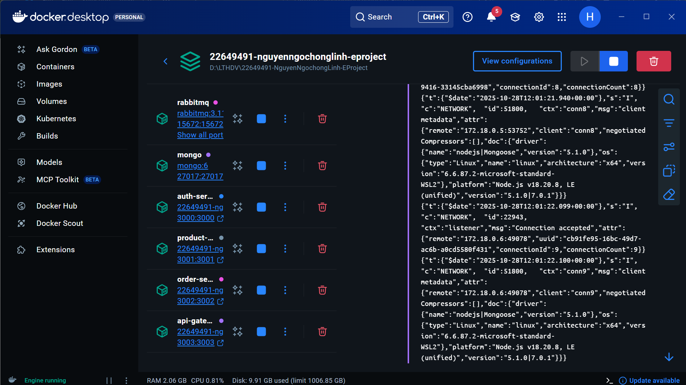
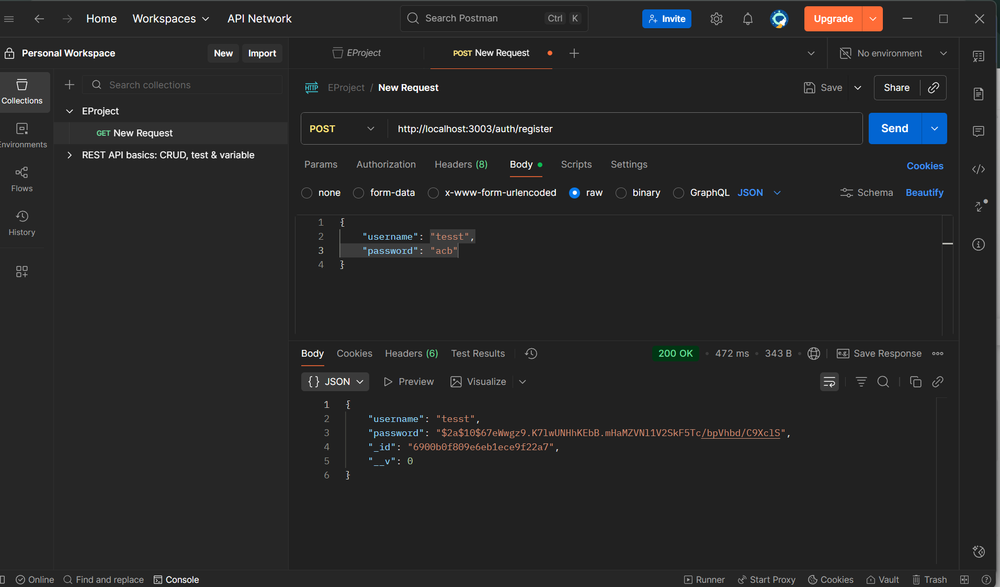
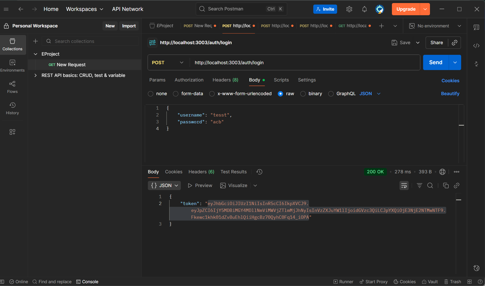
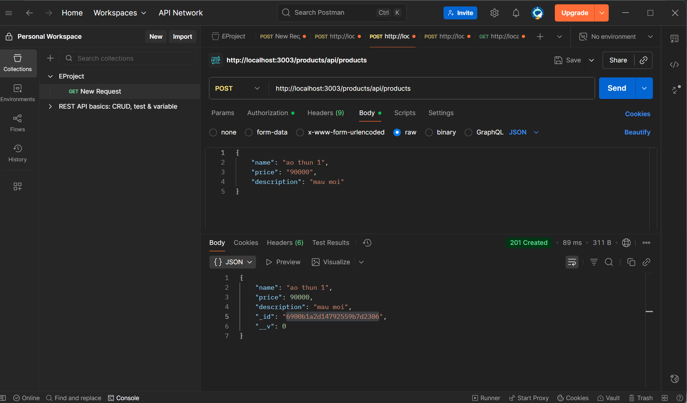
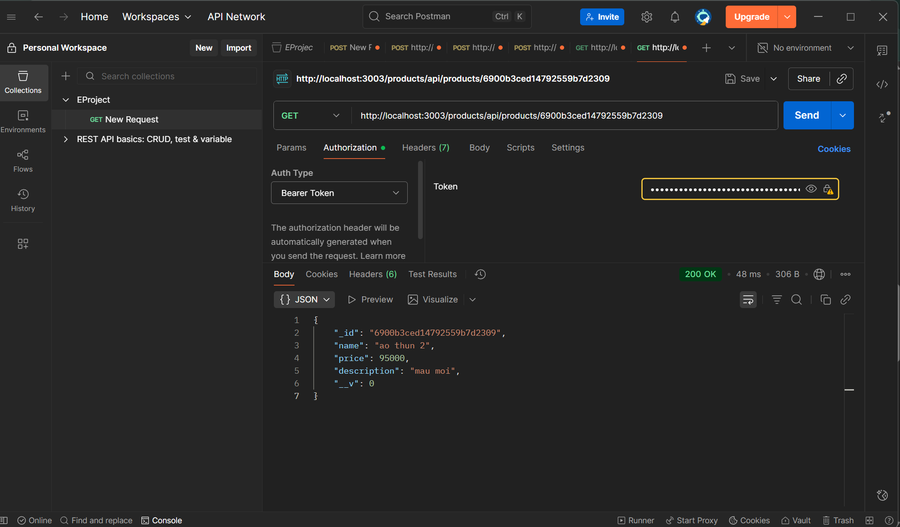
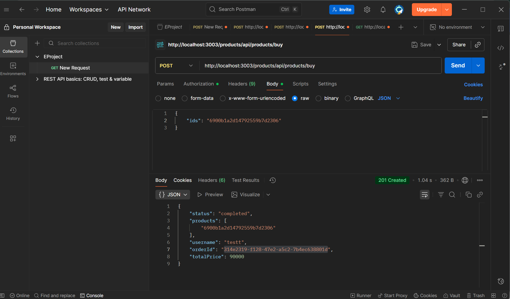
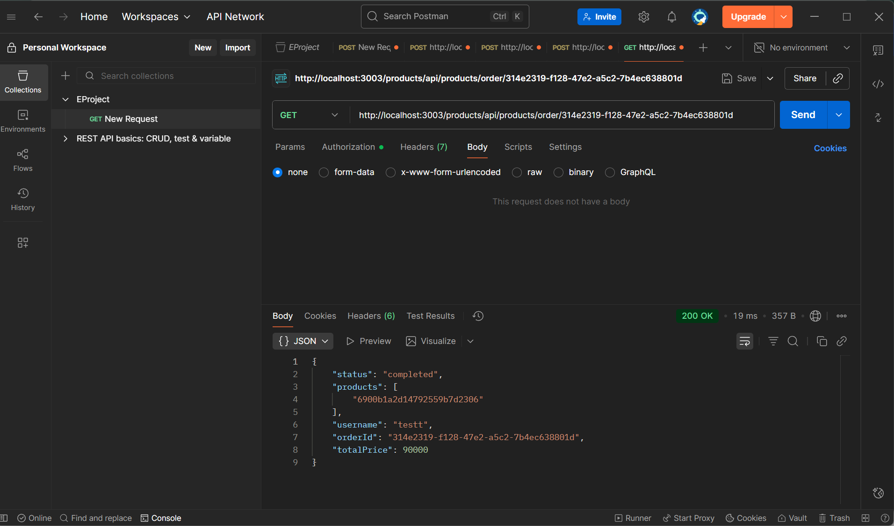

# E-COMMERCE MICROSERVICES — TÓM TẮT & HƯỚNG DẪN TEST

**Sinh viên:** Nguyễn Ngọc Hồng Linh

**MSSV:** 22649491

---

## 1. Tổng quan ngắn

Đây là hệ thống thương mại điện tử nhỏ được thiết kế theo hướng microservice giải quyết các vấn đề về quản lý đơn hàng, quản lý sản phẩm, bảo mật người dùng

---

## 2. Kiến trúc hệ thống

```
┌─────────────┐
│   Client    │
│  (Postman)  │
└──────┬──────┘
       │
       ▼
┌─────────────────────────────────────────┐
│         API Gateway (Port 3003)         │
│     (Optional - Direct access OK)       │
└────────┬──────────────┬─────────────────┘
         │              │
    ┌────▼────┐    ┌────▼──────┐
    │  Auth   │    │  Product  │
    │ Service │    │  Service  │
    │  :3000  │    │   :3001   │
    └────┬────┘    └────┬──────┘
         │              │
         │         ┌────▼────────┐
         │         │  RabbitMQ   │
         │         │   :5672     │
         │         └────┬────────┘
         │              │
         │         ┌────▼────┐
         │         │  Order  │
         │         │ Service │
         │         │  :3002  │
         ▼         └─────────┘
    ┌─────────┐
    │ MongoDB │
    │ :27017  │
    └─────────┘
```
## 3. Ý nghĩa / chức năng từng dịch vụ

- API Gateway: là bộ định tuyến làm điểm truy cập duy nhất cho client, chuyển tiếp request tới dịch vụ tương ứng.
- Auth Service: xử lý đăng ký, đăng nhập, cấp và xác thực JWT cho các yêu cầu bảo mật.
- Product Service: quản lý dữ liệu sản phẩm (tạo, liệt kê, lấy theo id), tạo yêu cầu mua hàng (order) và gửi thông tin sang hàng đợi (queue orders) để Order Service xử lý.
- Order Service: Nhận các yêu cầu mua hàng từ queue “orders” (do Product Service gửi sang), xử lý đơn hàng và Gửi kết quả ngược lại qua queue “products”.

## 4. Các dịch vụ giao tiếp như thế nào?

- Client → API Gateway → (HTTP REST) → các service (Auth/Product/Order) cho các thao tác đồng bộ.
- Product Service ↔ Order Service: giao tiếp bất đồng bộ qua RabbitMQ (publish/consume messages). 


## Chạy toàn bộ stack (Docker Compose)
Từ thư mục project root (nơi có `docker-compose.yml`):

```powershell
docker-compose up --build -d
```


Để xem container đang chạy:

```powershell
docker ps
```


## TEST POSTMAN
### Auth
- POST /register — đăng ký user

- POST /login — đăng nhập, trả về `token`



### Product (protected — Bearer JWT required)
- POST /api/products — tạo sản phẩm
  - Header: `Authorization: Bearer <token>`

- GET /api/products — danh sách sản phẩm

- GET /api/products/:id — chi tiết 1 product

- POST /api/products/buy — mua sản phẩm (body `{ ids: ["<productId>"] }`) — luồng dùng RabbitMQ + order-service

- GET /api/products/order/:orderId — lấy trạng thái hóa đơn theo orderId (được trả khi buy hoàn thành)


---

