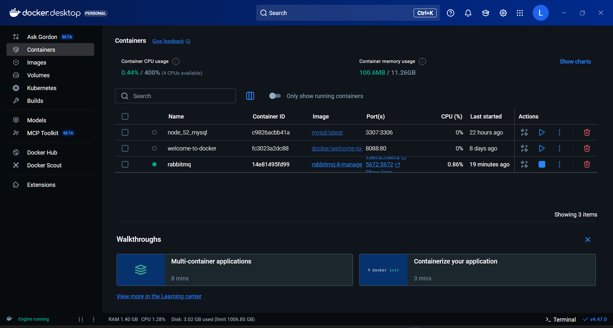
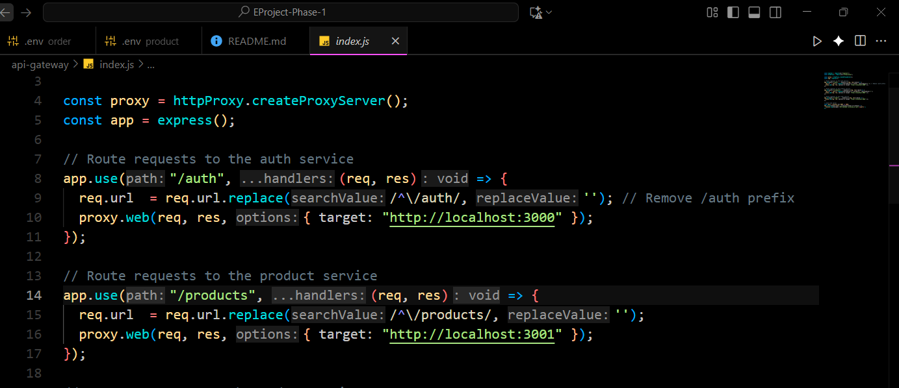
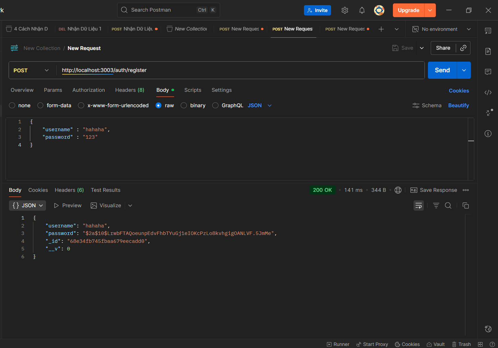
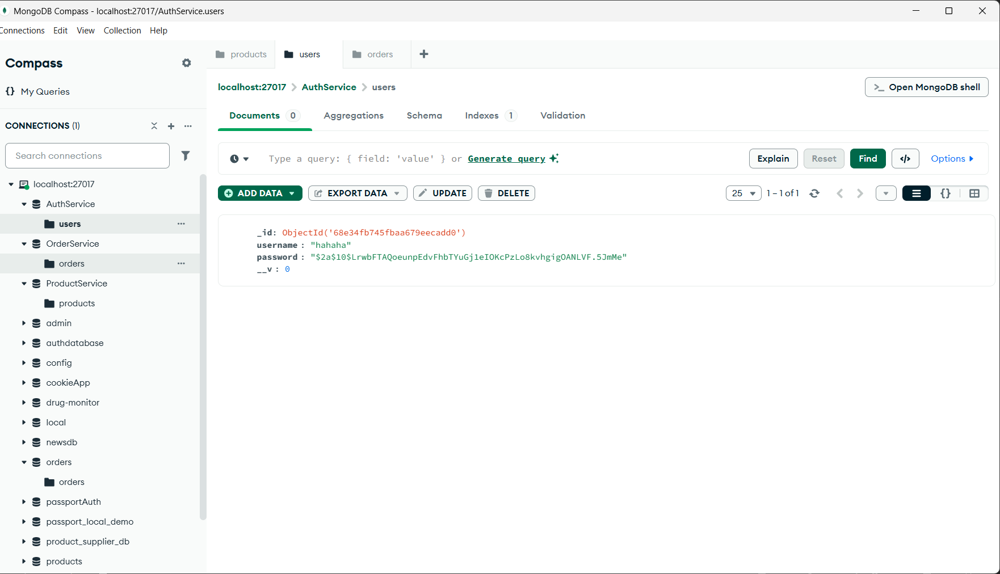
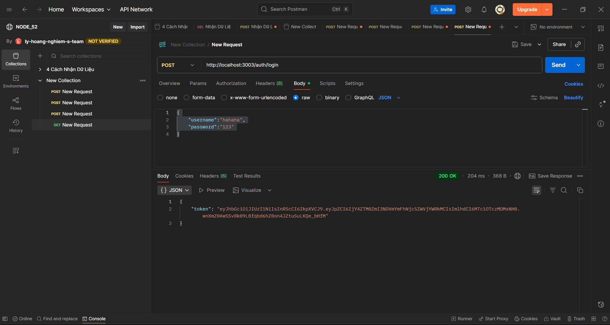
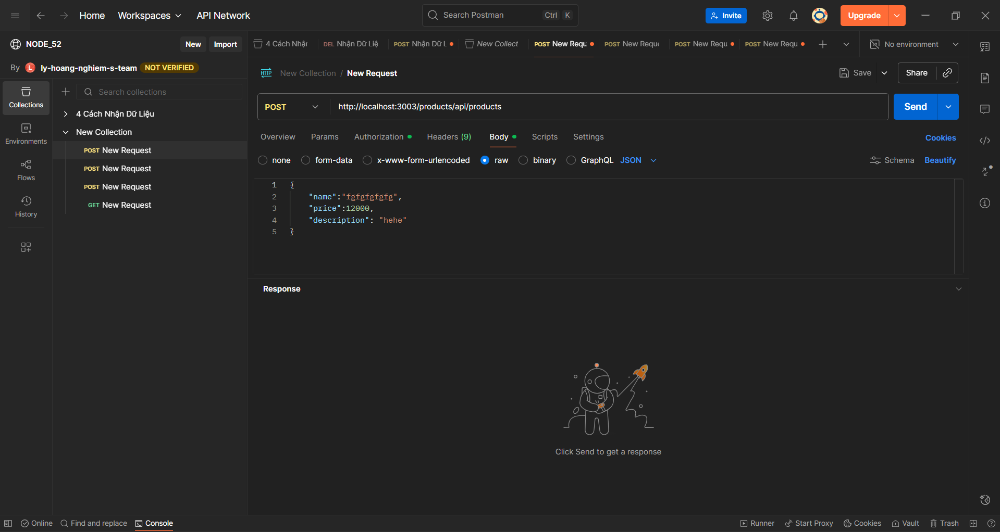
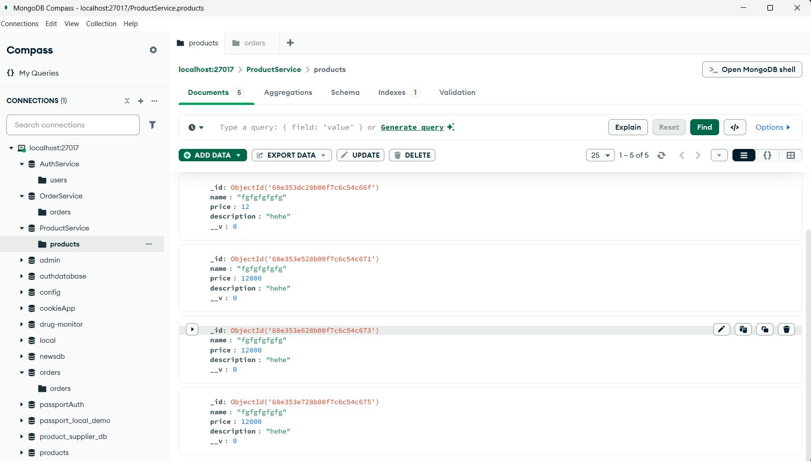
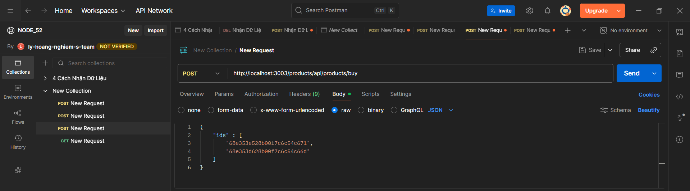
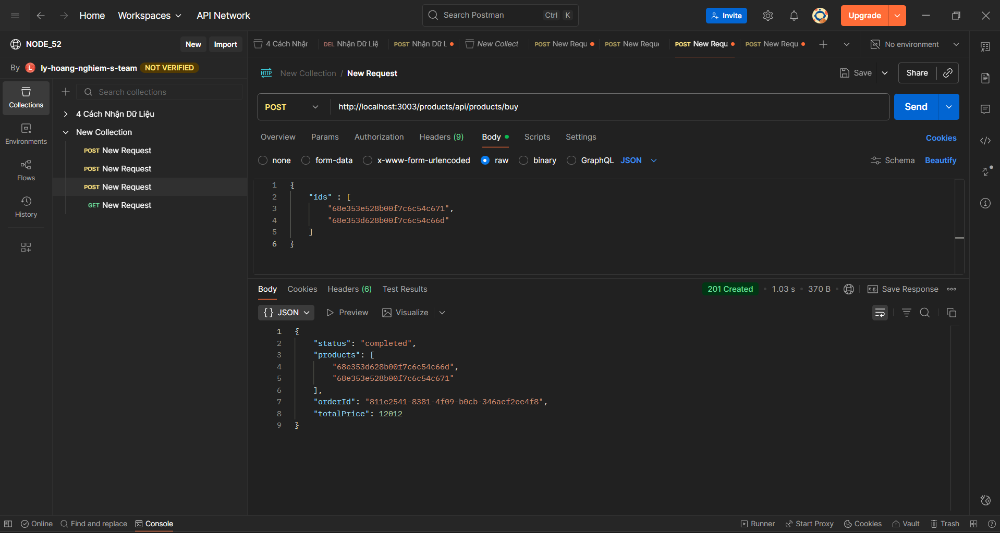
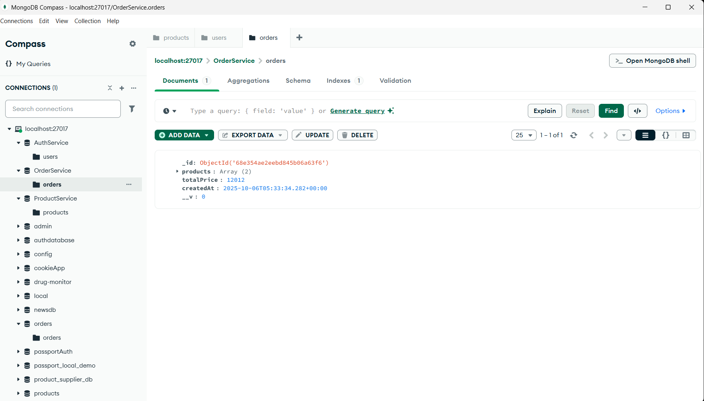

# EProject Phase 1 — Microservices with RabbitMQ and API Gateway

## Giới thiệu

Dự án **EProject Phase 1** là hệ thống thương mại điện tử được thiết kế theo kiến trúc **Microservices**.
Các thành phần chính bao gồm:

- **API Gateway**: điều phối các yêu cầu đến đúng service.
- **RabbitMQ**: trung gian giao tiếp giữa các service.
- **User Service**, **Product Service**, **Order Service**: chịu trách nhiệm xử lý nghiệp vụ riêng biệt.

---

##  1. Cài đặt môi trường

### **Yêu cầu hệ thống**

- Node.js (v18+)
- Docker Desktop
- Postman (để test API)
- Git

---

## 2. Cài đặt RabbitMQ qua Docker

### **Chạy lệnh sau để khởi tạo container RabbitMQ**

```bash
docker run -d --name rabbitmq \
 -p 5672:5672 -p 15672:15672 \
 rabbitmq:4-management
```

> ⚠️ **Lưu ý:**
>
> - Truy cập giao diện quản trị tại: [http://localhost:15672](http://localhost:15672)
> - Tài khoản mặc định: `guest` / `guest`
> - Nếu muốn RabbitMQ hoạt động vĩnh viễn (không mất khi tắt máy), hãy thêm cờ volume:
>
> ```bash
> docker run -d --name rabbitmq \
> -p 5672:5672 -p 15672:15672 \
> -v rabbitmq_data:/var/lib/rabbitmq \
> rabbitmq:4-management
> ```

📷 _Ảnh minh họa:_ 

---

## 3. Thiết lập các Microservices

### **Bước 1. Clone project**

```bash
git clone <repository_url>
cd EProject-Phase-1
```

### **Bước 2. Cài đặt dependencies**

```bash
npm install
```

### **Bước 3. Cấu hình môi trường**

Tạo file `.env` cho từng service (ví dụ: `user-service`, `product-service`, `order-service`) với các biến:

```
PORT=xxxx
MONGO_URI=mongodb+srv://...
RABBITMQ_URL=amqp://localhost
JWT_SECRET=your_secret_key
```


---

## 4. Chạy toàn bộ hệ thống

Khởi động tất cả microservices (User, Product, Order, Gateway) bằng các lệnh riêng:

```bash
cd api-gateway && npm start
cd user-service && npm start
cd product-service && npm start
cd order-service && npm start
```

API Gateway sẽ điều phối các request đến đúng service tương ứng.
📷 _Ảnh minh họa:_ 

---

## 5. Kiểm thử chức năng với Postman

### **1️. Đăng ký tài khoản**

**POST** `/auth/register`
📷 _Ảnh minh họa:_ 

Kết quả trong database: 

---

### **2. Đăng nhập và nhận token**

**POST** `/auth/login`
Sau khi đăng nhập thành công, hệ thống trả về **JWT Token**.
📷 _Ảnh minh họa:_ 

Token này được dùng để xác thực các request tiếp theo.

---

### **3️. Thêm sản phẩm**

**POST** `/product/add`
Gửi token trong header `Authorization: Bearer <token>`

📦 _Body ví dụ:_ 

📷 _Kết quả trả về:_ 

📂 _Dữ liệu lưu trong database:_ 

---

### **4. Tạo đơn hàng**

**POST** `/order/create`
Gửi token trong Headers và danh sách ID sản phẩm trong body:

📋 _Header:_
`Authorization: Bearer <token>`

📋 _Body:_ 

📷 _Kết quả trả về:_ 

📂 _Dữ liệu trong database:_ 

---

## 6. Kết quả đạt được

- Kết nối thành công giữa các microservice qua RabbitMQ.
- API Gateway hoạt động đúng, định tuyến chính xác.
- Chức năng đăng ký, đăng nhập, thêm sản phẩm, đặt hàng hoạt động ổn định.
- Dữ liệu lưu trữ chính xác trong MongoDB.

---


```
